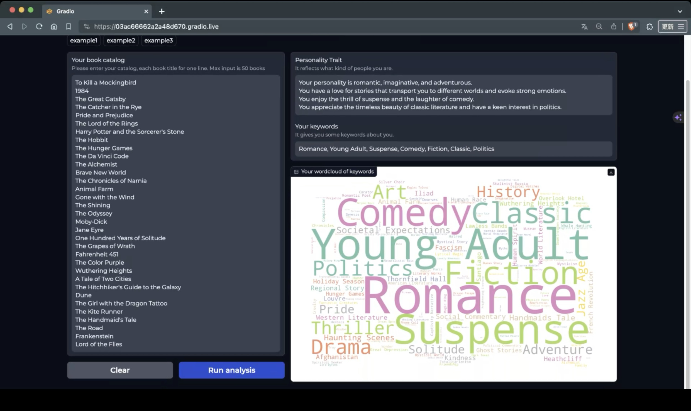

# 2023 FALL ADL final project -- books wrapped

* Team: `25`

* Members: `梁舜勛`, `楊子民`, `楊瀚博`, `羅晴`, `李語婕`

### Introduction
* like Spotify's annual review named Spotify wrapped, this is an English books' version annual review named `Books wrapped``
* use a web crawler to catch books' abstracts, generate keywords from books' abstracts, plot a wordcloud of keywords, and finally generate your own personality from keywords 

### Running logic
1. input book catalog
   * just need book titles
   * every book title separated by `\n`
2. use a web crawler to search `Amazon book {book title}` on Google, click the first result except for the advertisements, and catch the abstract from the Amazon book
3. input abstract to `keywords_generator (module1)`, generate logits of keywords, and convert logits to scores
4. input the top 7 of keywords scores to `comments_generator (module2)`, and generate personality
5. use all keyword scores to plot the wordcloud of all keywords

#### Function of every directory
The details of running are in the README.md of the directory respectively.
* `keywords_generator`: the keywords generator's data preparation, training, and inference
* `comments_generator`: the comments generator's training and inference
* `demo`: integrate the fine-tuned modules and front end, run a web UI
