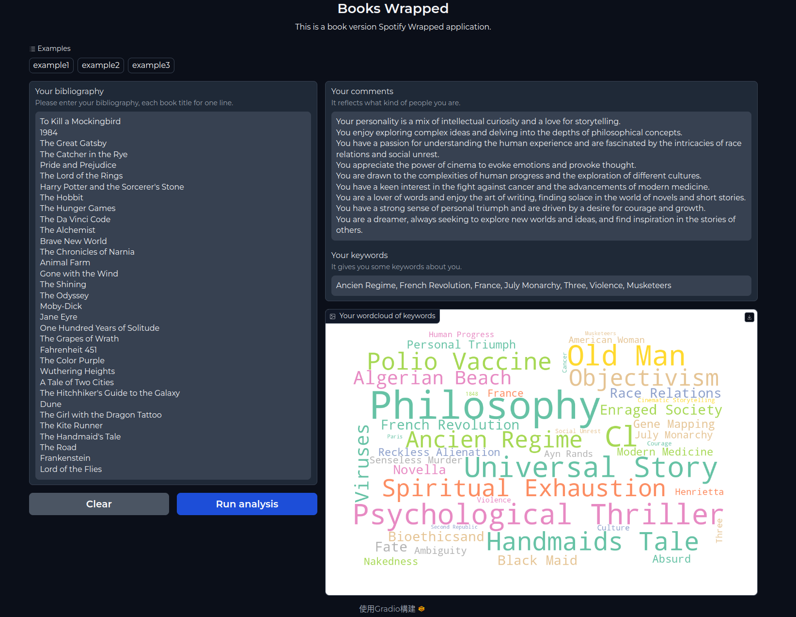

# 2023 FALL ADL final project -- book wrapped

* 組別：`第25組`

* 成員：`梁舜勛`, `楊子民`, `楊瀚博`, `羅晴`, `李語婕`

### Introduction
* 模仿 Spotify 的年度回顧，做一個英文書版本的年度回顧
* 根據書的摘要分析書的 keywords 後畫成 wordcloud，並根據 keywords 產生一個屬於你的個人評價



### 運作邏輯
1. input 書目
   * 書名即可
   * 每本書以換行分隔
2. 爬蟲 google 搜尋 `amazon book {book title}` 點選廣告除外的第一個搜尋結果，抓取 amazon 上的摘要
3. 將摘要送給 model1 生成 keywords 的 logits
4. 累計 keywords logits，把前 7 名送給 model2，根據這幾個 keywords 生成 comments
5. 用完整累計後 keywords logits 去畫 wordcloud

### Reproduce

#### Download 
* clone or download this repository
* download line 群組的 `keywords_generator.zip` 把裡面的 `distilbert_keyphrase_extraction_v2` 放到 `./script/keywords_generator/distilbert_keyphrase_extraction_v2`
* download [comments_generator](https://drive.google.com/drive/folders/1pqQUWoSl-ZVYUvdvOVbTjngeDjYfwqJb?usp=drive_link) 把裡面的 `checkpoint-2000` 放到 `./script/comments_generator/checkpoint-2000` (之後連結應該會過期)
* clone or download [base model](https://huggingface.co/NousResearch/Llama-2-7b-chat-hf) 放到 `./script/comments_generator/Llama-2-7b-chat-hf`
  * 把裡面的 `generation_config.json` 移除或改名


#### Set up environment

* 安裝conda
* 裝google-chrome瀏覽器
* 須在linux底下跑
* 跑以下指令：
    ```bash
    # 準備conda環境
    conda create --name ADL_HW3_final_project python=3.10
    conda activate ADL_final_project

    # 準備python套件
    pip install -r ./script/requirements.txt
    python -m spacy download en_core_web_sm
    ```


#### Run
```bash
gradio ./script/frontend.py
```

#### Problem
* 關掉 server 後它顯示卡記憶體不會馬上釋放，要自己去kill
* 爬蟲爬太多書 (上次一次爬70本) 之後 IP 會被 google擋，只能換 IP 或隔一陣子之後再恢復
  * 不只 google 會擋，amazon 也有擋過，但 amazon 不會一直連續擋，只會擋其中一兩個其他的沒事
* 測試過一次同時有兩個人要 run analysis，那次會卡住，後來想說這個 demo 應該先不用考慮給一堆人用的情況就暫時沒處理